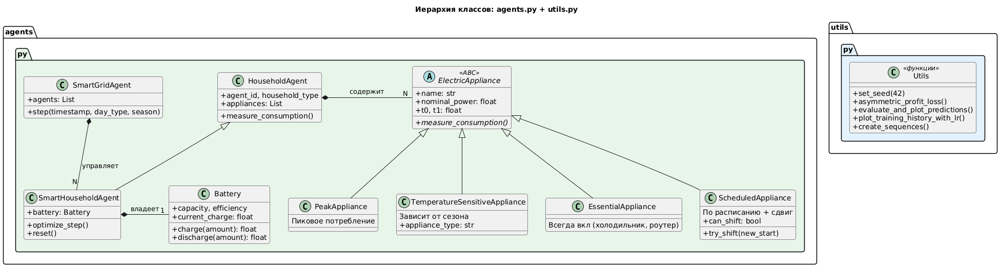
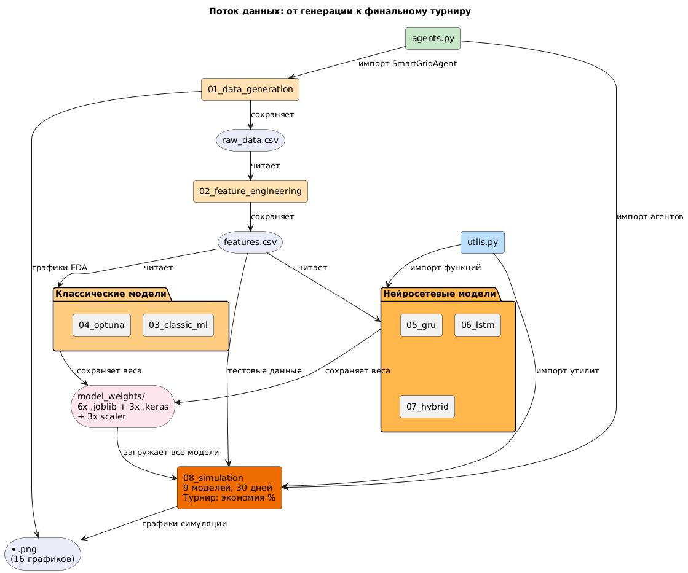
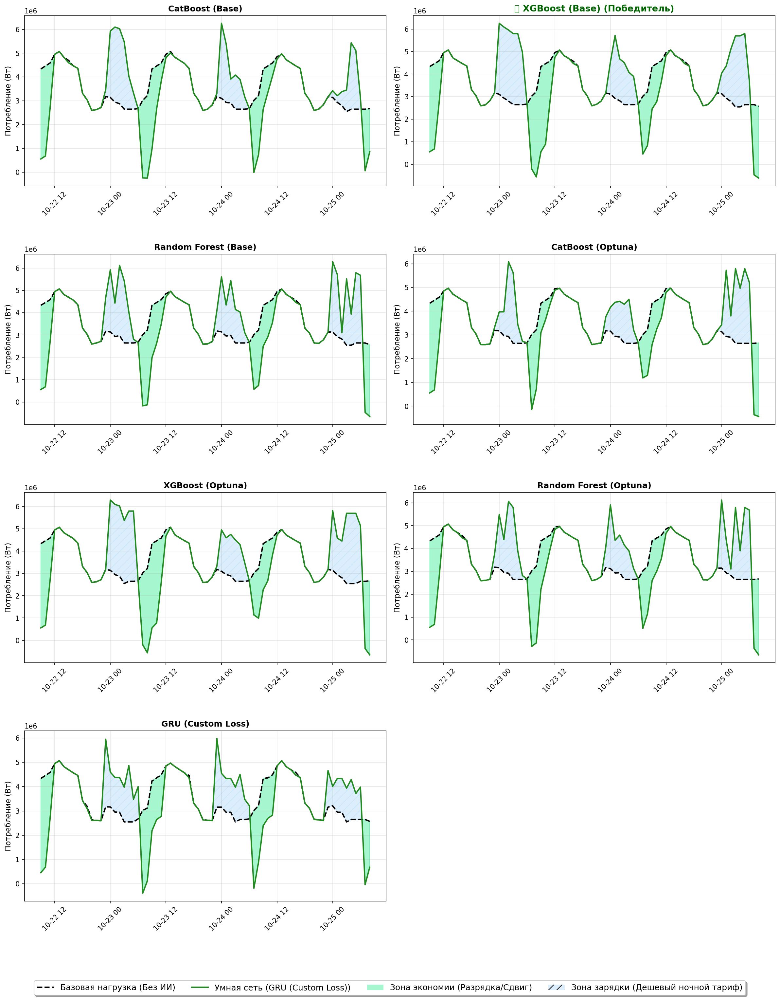

# Smart Grid Optimization

Комплексный проект по прогнозированию энергопотребления и оптимизации работы умной электросети с использованием мультиагентной симуляции и ансамбля ML/DL-моделей.

---

## Описание проекта

Проект моделирует **умную электросеть** (Smart Grid), в которой:

1. **Агентная модель** генерирует реалистичные данные энергопотребления для 141 потребителя (60 жилых, 80 коммерческих, 1 промышленный) за 365 дней (8760 часов).
2. **ML-пайплайн** обучает **9 моделей** прогнозирования потребления на 24 часа вперёд.
3. **Экономическая симуляция** сравнивает модели в турнире: агенты используют прогнозы для оптимизации нагрузки (Load Shifting + Battery Arbitrage) и экономии на динамических тарифах.

### Ключевые технологии

| Компонент | Технологии |
|-----------|-----------|
| **Классические ML-модели** | XGBoost, CatBoost (MultiRMSE), Random Forest |
| **Гиперпараметрическая оптимизация** | Optuna (30 trials per model) |
| **Нейросетевые модели** | GRU, LSTM, Hybrid (CNN + LSTM + Multi-Head Attention) |
| **Custom Loss** | Асимметричная функция потерь (штраф 3:1 за недопрогноз) |
| **Симуляция** | Мультиагентная система с динамическим тарифообразованием (ToU + congestion pricing) |

---

## Архитектура проекта

### Иерархия классов

<p align="center">
  
</p>

### Поток данных (Data Flow)

<p align="center">
  
</p>

---

## Структура файлов

```
smart_grid/
├── agents.py                      # Классы агентов и приборов (OOP)
├── utils.py                       # Общие утилиты: loss, метрики, визуализация
│
├── 01_data_generation.ipynb       # Генерация данных агентной моделью + EDA
├── 02_feature_engineering.ipynb   # Feature engineering (лаги, sin/cos, EMA, TE)
├── 03_classic_ml.ipynb            # Базовые модели: XGBoost, CatBoost, RF
├── 04_classic_ml_optuna.ipynb     # Optuna HPO для классических моделей
├── 05_gru.ipynb                   # Модель GRU с кастомным loss
├── 06_lstm.ipynb                  # Модель LSTM с кастомным loss
├── 07_hybrid.ipynb                # Гибрид: CNN + LSTM + Multi-Head Attention
├── 08_simulation.ipynb            # Финальный турнир всех 9 моделей
│
├── data/
│   ├── raw_data.csv               # Сырые данные (8760 часов)
│   ├── features.csv               # Датасет с 60+ признаками
│   ├── uml_classes.png/svg        # UML-диаграмма классов
│   ├── uml_dataflow.png/svg       # UML-диаграмма потока данных
│   └── *.png                      # 16 графиков (EDA, обучение, симуляция)
│
└── model_weights/
    ├── xgb_base.joblib            # XGBoost (базовый)
    ├── catboost_base.joblib       # CatBoost (базовый)
    ├── rf_base.joblib             # Random Forest (базовый)
    ├── xgb_optuna.joblib          # XGBoost (Optuna)
    ├── catboost_optuna.joblib     # CatBoost (Optuna)
    ├── rf_optuna.joblib           # Random Forest (Optuna)
    ├── gru_model.keras            # GRU
    ├── lstm_model.keras           # LSTM
    ├── hybrid_model.keras         # Hybrid CNN+LSTM+Attention
    └── scaler_*.joblib            # StandardScaler для каждой DL-модели
```

---

## Подход к ML

### Sequence-to-Vector (без заглядывания в будущее)

Для нейросетевых моделей используется подход **Sequence-to-Vector**: входное окно из 24 часов истории → прогноз на следующие 24 часа. Данные разделены **хронологически** (80/20), лаги рассчитаны строго с `shift(1)`, что исключает data leakage.

### Архитектура Hybrid-модели (CNN + LSTM + Attention)

```
Input(24, N_features)
  → Conv1D(64, k=5, swish) → BatchNorm
  → Conv1D(128, k=3, swish) → BatchNorm
  → MaxPool1D(2)
  → LSTM(128, return_sequences) → LayerNorm
  → LSTM(64, return_sequences) → LayerNorm
  → Multi-Head Self-Attention (8 голов, key_dim=64) + Residual + LayerNorm
  → GlobalAveragePooling1D
  → Dense(128, swish) → Dense(64, swish)
  → Dense(24, linear) — Output: прогноз на 24 часа
```

### Кастомная функция потерь

```python
# Асимметричный loss: недопрогноз штрафуется в 3 раза сильнее
def asymmetric_profit_loss(y_true, y_pred):
    error = y_true - y_pred
    loss = tf.where(error > 0,
                    tf.square(error) * 3.0,   # Недопрогноз (опасно)
                    tf.square(error) * 1.0)   # Перепрогноз (менее критично)
    return tf.reduce_mean(loss)
```

### Feature Engineering (60+ признаков)

- **Циклические**: `sin/cos` для часа, дня недели, дня года
- **Лаги**: 1, 2, 4, 12, 24, 48, 168 часов
- **Скользящие окна**: mean, std, min, max, quantiles (3h–168h)
- **EMA**: экспоненциальные средние (12, 24, 168)
- **Target Encoding**: `day_type`, `season` (fit только на train)

---

## Экономическая симуляция

Агенты (`SmartHouseholdAgent`) используют прогнозы моделей для оптимизации:

1. **Load Shifting** — сдвиг гибких нагрузок (стиральная машина, посудомоечная, зарядка EV) на дешёвые часы.
2. **Battery Arbitrage** — зарядка аккумулятора в ночной тариф, разрядка в пиковый.

Тарифообразование — **динамическое**: base rate × time-of-use (день/ночь) × load factor.

---

## Результаты

Финальный 30-дневный турнир сравнивает **9 моделей** по проценту экономии:

<p align="center">
  
</p>

---

## Запуск проекта

### Требования

- Python 3.10+
- TensorFlow 2.x
- scikit-learn, XGBoost, CatBoost, Optuna
- pandas, numpy, matplotlib, seaborn, joblib

### Порядок запуска ноутбуков

```bash
# 1. Генерация данных
jupyter notebook 01_data_generation.ipynb

# 2. Feature Engineering
jupyter notebook 02_feature_engineering.ipynb

# 3. Обучение моделей (можно параллельно)
jupyter notebook 03_classic_ml.ipynb
jupyter notebook 04_classic_ml_optuna.ipynb
jupyter notebook 05_gru.ipynb
jupyter notebook 06_lstm.ipynb
jupyter notebook 07_hybrid.ipynb

# 4. Финальная симуляция
jupyter notebook 08_simulation.ipynb
```

---

## Лицензия

MIT License
