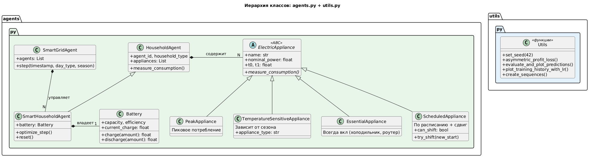
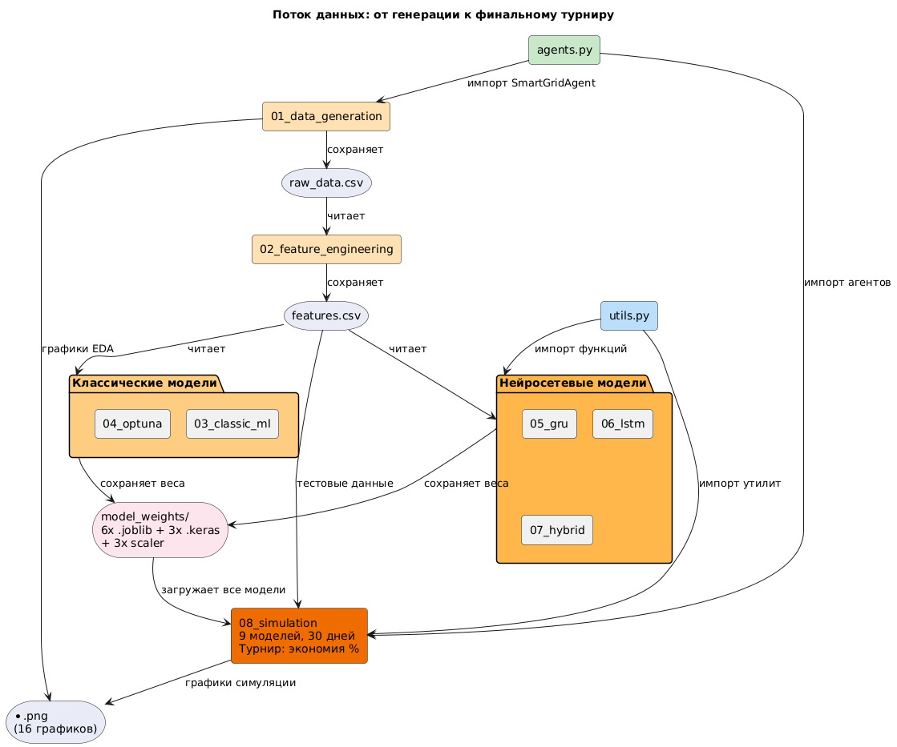
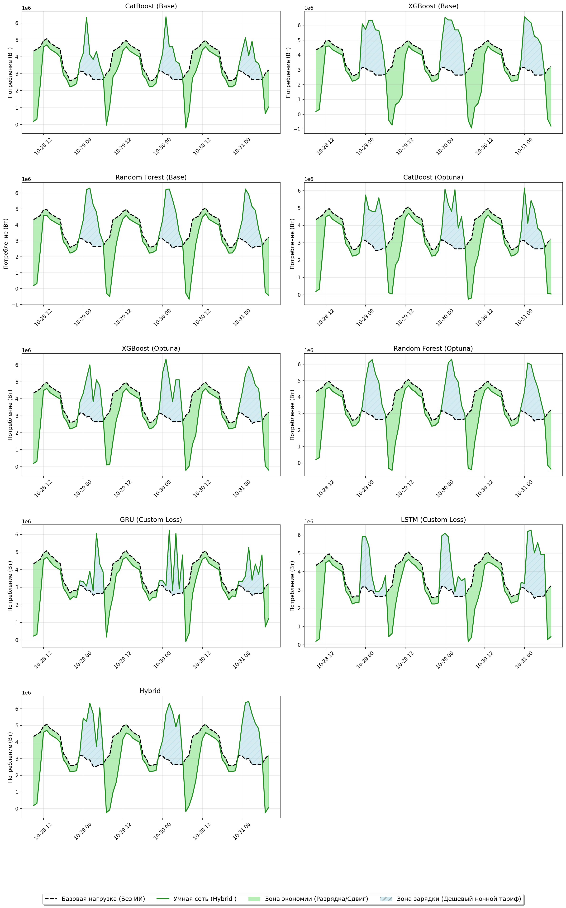

# Smart Grid Optimization

Комплексный проект по прогнозированию энергопотребления и оптимизации работы умной электросети с использованием мультиагентной симуляции и ансамбля ML/DL-моделей.

---

## Описание проекта

Проект моделирует **умную электросеть** (Smart Grid), в которой:

1. **Агентная модель** генерирует реалистичные данные энергопотребления для 141 потребителя (60 жилых, 80 коммерческих, 1 промышленный) и парка электромобилей (EV) за 365 дней (8760 часов).
2. **ML-пайплайн** обучает **9 моделей** прогнозирования потребления на 24 часа вперёд.
3. **Экономическая симуляция** сравнивает модели в турнире: агенты используют прогнозы для оптимизации нагрузки (Load Shifting, Battery Arbitrage, V2G) и экономии на динамических тарифах.

### Ключевые технологии

| Компонент | Технологии |
|-----------|-----------|
| **Классические ML-модели** | XGBoost, CatBoost (MultiRMSE), Random Forest |
| **Гиперпараметрическая оптимизация** | Optuna (30 trials per model) |
| **Нейросетевые модели** | GRU, LSTM, Hybrid (CNN + LSTM + Multi-Head Attention) |
| **Custom Loss** | Асимметричная функция потерь (штраф 3:1 за недопрогноз) |
| **Симуляция** | Мультиагентная система с динамическим тарифообразованием (ToU + congestion pricing) и V2G |

---

## Архитектура проекта

### Иерархия классов

<p align="center">
  
</p>

### Поток данных (Data Flow)

<p align="center">
  
</p>

---

## Структура файлов

```text
smart_grid/
├── agents.py                      # Классы агентов, электромобилей и приборов (OOP)
├── utils.py                       # Общие утилиты: loss, метрики, архитектура сетей
├── read_data.py                   # Проверка статистик и распределений данных
├── apply_fixes.py                 # Скрипт форматирования и правок LaTeX-отчетов
├── fix.py                         # Вспомогательный скрипт автозамены
│
├── 01_data_generation.ipynb       # Генерация данных агентной моделью + EDA
├── 02_feature_engineering.ipynb   # Feature engineering (лаги, sin/cos, EMA, TE)
├── 03_classic_ml.ipynb            # Базовые модели: XGBoost, CatBoost, RF
├── 04_classic_ml_optuna.ipynb     # Optuna HPO для классических моделей
├── 05_gru.ipynb                   # Модель GRU с кастомным loss
├── 06_lstm.ipynb                  # Модель LSTM с кастомным loss
├── 07_hybrid.ipynb                # Гибрид Advanced V2: CNN + LSTM + Attention
├── 08_simulation.ipynb            # Финальный турнир всех 9 моделей
├── 09_all_metrics.ipynb           # Сводный расчет классических и DL-метрик
├── src/
│   ├── 07-hybrid.ipynb            # Гибридная модель (базовая kaggle-версия)
├── data/
│   ├── raw_data.csv               # Сырые данные (8760 часов)
│   ├── features.csv               # Датасет с 60+ признаками
│   ├── uml_classes.png/svg        # UML-диаграмма классов
│   ├── uml_dataflow.png/svg       # UML-диаграмма потока данных
│   └── *.png                      # 16 графиков (EDA, обучение, симуляция)
│
└── model_weights/
    ├── xgb_base.joblib            # XGBoost (базовый)
    ├── catboost_base.joblib       # CatBoost (базовый)
    ├── rf_base.joblib             # Random Forest (базовый)
    ├── xgb_optuna.joblib          # XGBoost (Optuna)
    ├── catboost_optuna.joblib     # CatBoost (Optuna)
    ├── rf_optuna.joblib           # Random Forest (Optuna)
    ├── gru_model.keras            # GRU
    ├── lstm_model.keras           # LSTM
    ├── hybrid_model.keras         # Hybrid CNN+LSTM+Attention (Legacy/Advanced)
    ├── y_scaler_hybrid.joblib     # Скейлер таргета
    └── scaler_*.joblib            # StandardScaler для каждой DL-модели
```

---

## Подход к ML

### Sequence-to-Vector (без заглядывания в будущее)

Для нейросетевых моделей используется подход **Sequence-to-Vector**: входное окно из **168 часов истории (одна неделя)** → прогноз на следующие 24 часа. Данные разделены **хронологически** (80/20), лаги рассчитаны строго с `shift(1)`, что исключает data leakage.

### Архитектура Hybrid_Advanced_V2 (CNN + LSTM + Cross/Self-Attention)

В ноутбуке [07_hybrid.ipynb](file:///c:/Users/Kirill/Desktop/smart_grid/07_hybrid.ipynb) обучается усовершенствованная архитектура нейросети на базе функции активации **Swish**, включающая мощную CNN с остаточными связями (residual blocks), глубокую RNN и двухуровневое внимание:

```text
Input(168, N_features)
  ├── 1. Блок CNN с остаточными связями (L2 regularizer 5e-5, Dropout 0.3):
  │     ├── Conv1D(64, k=7, padding='same', swish) → BatchNorm → Dropout(0.3)
  │     ├── Conv1D(128, k=5, padding='same', swish) → BatchNorm ─┐ (residual: Conv1D(128, k=1) + Add + Swish) → Dropout(0.3)
  │     ├── Conv1D(256, k=3, padding='same', swish) → BatchNorm ─┐ (residual: Conv1D(256, k=1) + Add + Swish) → Dropout(0.3)
  │     └── MaxPooling1D(pool_size=2)
  │
  ├── 2. Глубокий RNN блок (Stacked LSTM):
  │     ├── LSTM(256, return_sequences=True) → LayerNorm → Dropout(0.3)
  │     ├── LSTM(128, return_sequences=True) → LayerNorm → Dropout(0.3)
  │     └── LSTM(64, return_sequences=True) → LayerNorm
  │
  ├── 3. Двухуровневое внимание:
  │     ├── Кросс-внимание (Cross-Attention) между RNN и CNN: MultiHeadAttention (8 голов, key_dim=64) + Residual + LayerNorm
  │     └── Самовнимание (Self-Attention) внутри RNN: MultiHeadAttention (8 голов, key_dim=64) + Residual + LayerNorm
  │
  ├── 4. Агрегация:
  │     └── GlobalAveragePooling1D & GlobalMaxPooling1D → Concatenate
  │
  └── 5. Полносвязная голова:
        ├── Dense(256, swish) → BatchNorm → Dropout(0.3)
        ├── Dense(128, swish) → BatchNorm → Dropout(0.3)
        ├── Dense(64, swish)
        └── Dense(24, linear) — Output: прогноз на 24 часа
```

*Примечание: Базовая/legacy архитектура `build_legacy_hybrid_model` (на Mish, c Conv1D(64, k=3) → Conv1D(128, k=3) → LSTM(128) → MultiHeadAttention(32 dim)) сохранена в [utils.py](file:///c:/Users/Kirill/Desktop/smart_grid/utils.py) для обратной совместимости с весами Kaggle.*

### Кастомная функция потерь

```python
# Асимметричный loss: недопрогноз штрафуется в 3 раза сильнее
def asymmetric_profit_loss(y_true, y_pred):
    error = y_true - y_pred
    loss = tf.where(error > 0,
                    tf.square(error) * 3.0,   # Недопрогноз (опасно)
                    tf.square(error) * 1.0)   # Перепрогноз (менее критично)
    return tf.reduce_mean(loss)
```

### Feature Engineering (60+ признаков)

- **Циклические**: `sin/cos` для часа, дня недели, дня года
- **Лаги**: 1, 2, 4, 12, 24, 48, 168 часов
- **Скользящие окна**: mean, std, min, max, quantiles (3h–168h)
- **EMA**: экспоненциальные средние (12, 24, 168)
- **Target Encoding**: `day_type`, `season` (fit только на train)

---

## Экономическая симуляция

Агенты (`SmartHouseholdAgent`) используют прогнозы моделей для комплексной оптимизации потребления:

1. **Load Shifting** — сдвиг гибких нагрузок (стиральная машина, посудомоечная и т.д.) на дешёвые часы.
2. **Battery Arbitrage** — зарядка домашних аккумуляторов в ночной тариф, разрядка в пиковый.
3. **Smart EV Charging & V2G (Vehicle-to-Grid)** — Умная зарядка парка электромобилей (поддерживается 12 реальных моделей: Tesla, VW, NIO, BYD, XPeng и др.). Автомобили агрессивно заряжаются при низких ценах и отдают энергию обратно в сеть (разряжаются) во время пиковых нагрузок для стабилизации сети.

Тарифообразование — **динамическое**: base rate × time-of-use (день/ночь) × load factor.

---

## Результаты

Проект решает две ключевые задачи: точное прогнозирование энергопотребления (ML/DL-регрессия) и минимизация затрат на энергоснабжение (экономическая мультиагентная симуляция).

### 1. Точность прогнозирования (Тестовая выборка)

Полный расчет метрик прогнозирования на тестовой выборке (выполняется в ноутбуке [09_all_metrics.ipynb](file:///c:/Users/Kirill/Desktop/smart_grid/09_all_metrics.ipynb)) показывает следующие результаты (модели отсортированы по коэффициенту детерминации $R^2$):

| Модель | MAE | RMSE | MAPE, % | $R^2$ |
| :--- | :---: | :---: | :---: | :---: |
| **CatBoost (Optuna)** | 115 860.77 | 153 912.43 | 3.30% | **0.9754** |
| **XGBoost (Optuna)** | 111 816.89 | 157 490.70 | 3.16% | **0.9742** |
| **Random Forest (Optuna)** | 120 680.66 | 162 411.20 | 3.38% | **0.9726** |
| **GRU (Custom Loss)** | 119 488.48 | 167 063.73 | 3.49% | 0.9712 |
| **XGBoost (Base)** | 120 473.09 | 166 709.95 | 3.44% | 0.9711 |
| **Random Forest (Base)** | 134 436.90 | 176 996.81 | 3.78% | 0.9675 |
| **Hybrid (CNN+LSTM+Attention)** | 134 597,16 | 176 389,16 | **2.16%** | 0.9639 |
| **CatBoost (Base)** | 139 597.68 | 189 388.39 | 3.97% | 0.9628 |
| **LSTM (Custom Loss)** | 129 264.49 | 203 418.00 | 3.68% | 0.9573 |

*Примечание: Гибридная модель демонстрирует наилучшую относительную погрешность прогнозирования (MAPE = 2.16%).*

### 2. Результаты экономической симуляции (Турнир моделей)

В рамках 30-дневного симуляционного турнира (ноутбук [08_simulation.ipynb](file:///c:/Users/Kirill/Desktop/smart_grid/08_simulation.ipynb)) агенты использовали прогнозы каждой модели для оптимизации нагрузок (Load Shifting, Battery Arbitrage, V2G) при динамических тарифах. Результаты по финансовой эффективности и проценту экономии:

| Модель | Базовая стоимость (Base price) | Оптимизированная стоимость (Smart price) | Экономия (Savings) | Экономия (%) |
| :--- | :---: | :---: | :---: | :---: |
| **XGBoost (Base)** | 19 556 211 ₽ | 14 660 805 ₽ | 4 895 406 ₽ | **25.03%** |
| **XGBoost (Optuna)** | 19 559 893 ₽ | 15 187 200 ₽ | 4 372 693 ₽ | **22.36%** |
| **Hybrid** | 19 598 584 ₽ | 15 217 158 ₽ | 4 381 426 ₽ | **22.36%** |
| **Random Forest (Optuna)** | 19 594 028 ₽ | 15 250 594 ₽ | 4 343 434 ₽ | 22.17% |
| **CatBoost (Optuna)** | 19 566 768 ₽ | 15 258 565 ₽ | 4 308 203 ₽ | 22.02% |
| **Random Forest (Base)** | 19 581 376 ₽ | 15 256 935 ₽ | 4 324 441 ₽ | 22.08% |
| **LSTM (Custom Loss)** | 19 597 143 ₽ | 15 337 904 ₽ | 4 259 239 ₽ | 21.73% |
| **CatBoost (Base)** | 19 571 785 ₽ | 15 810 487 ₽ | 3 761 297 ₽ | 19.22% |
| **GRU (Custom Loss)** | 19 616 750 ₽ | 15 985 281 ₽ | 3 631 469 ₽ | 18.51% |

<p align="center">
  
</p>

---

## Запуск проекта

### Требования

- Python 3.10+
- TensorFlow 2.x
- scikit-learn, XGBoost, CatBoost, Optuna
- pandas, numpy, matplotlib, seaborn, joblib

### Порядок запуска ноутбуков

```bash
# 1. Генерация данных
jupyter notebook 01_data_generation.ipynb

# 2. Feature Engineering
jupyter notebook 02_feature_engineering.ipynb

# 3. Обучение моделей (можно параллельно)
jupyter notebook 03_classic_ml.ipynb
jupyter notebook 04_classic_ml_optuna.ipynb
jupyter notebook 05_gru.ipynb
jupyter notebook 06_lstm.ipynb
jupyter notebook 07_hybrid.ipynb

# 4. Сводная оценка точности
jupyter notebook 09_all_metrics.ipynb

# 5. Финальная симуляция умной сети
jupyter notebook 08_simulation.ipynb
```
